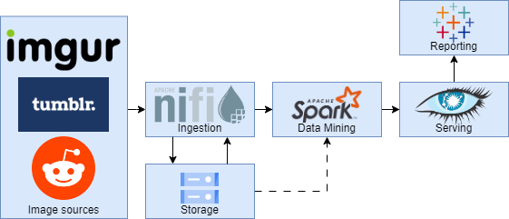
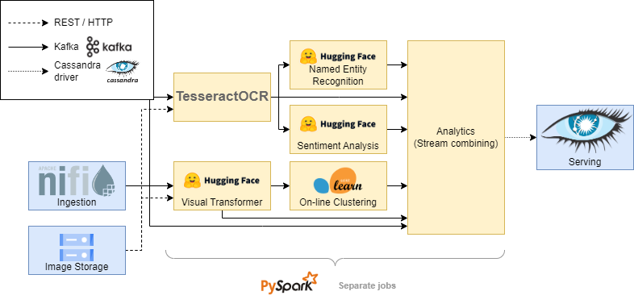
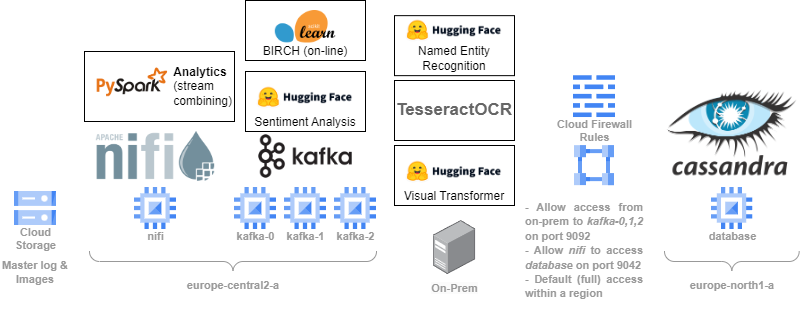

# Beeg Meme
`Authors: Kacper Grzymkowski, Mikołaj Malec, Illia Tesliuk, Jakub Fołtyn`

University Big Data Analytics project which aimed to analyse images (memes) posted on social media to try to extract potentially valuable information from them. 
Inspired by a meme which showed a Spider-man game ad for the PS5 next to an image making fun of the fact that Spider-man is the main exclusive title for the Playstation 5.
This made us think about how valuable this information can be for advertisements, and whether the social media sites already have a similar system in place.

## Technologies used
* Hosted on GCP (Minimal cloud: Compute engine + Cloud Storage)
* NiFi for ingestion, processing of metadata, downloading the images and storing them in GCS
* Kafka for transport
* Spark Structured Streaming for processing and management of data-mining models
* Huggingface models for: Image Embeddings, Named Entity Recognition, Sentiment Analysis
* Scikit-learn for online learning (clustering)
* Cassandra for storage of the resulting data
* Tableau for some minimal visualization

## Architecture Diagrams
The overview of the architecture used can be seen below. We use the Kappa architecture, meaning stream only, with no batch processing.

The analytical module is the most complex part of the project, and deserves its own diagram:

As the project progressed and we ran into more and more limitations, the infrastructure had to adapt as well:

